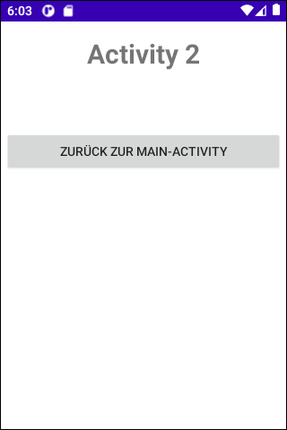

# Android-App "Intent-Callback" #

 

Dieses Repository enthält ein Android-Studio-Projekt für eine native Android-App mit Java, die
drei Activities enthält.

 

**!!! Der Quellcode ist unvollständig, muss als Übung vervollständig werden !!!**

 

----

## Screenshots ##

 

 &nbsp;&nbsp;  

 

----

## License ##

 

See the [LICENSE file](LICENSE.md) for license rights and limitations (BSD 3-Clause License).

 